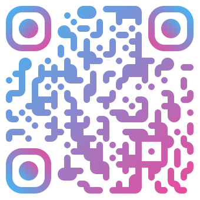

# 

# Shivam QR Code Generator

A beautiful, feature-rich QR code generator with offline support. Create stunning QR codes with custom shapes, gradients, logos, and multiple export formats.

[🌐 Visit Live Site](https://duurg-sk.github.io/Shivam-QR-Generator) • [⭐ Star this repo](https://github.com/duurg-sk/Shivam-QR-Generator) • [📸 View Examples](#examples)

---

## ✨ Features

- **🎨 Advanced Styling**
  - Linear and solid color modes
  - Gradient support for foreground and background
  - Transparent background option

- **🔷 Extended Geometry**
  - Multiple data pixel shapes (square, rounded, dots, leaves, pills, liquid, mesh, etc.)
  - Customizable corner patterns (eye frames)
  - Adjustable inner eye designs

- **🏷️ Logo Support**
  - Add logos/images to the center of QR codes
  - Adjustable logo scale (10%-45%)
  - Automatic background dot hiding for clarity

- **📤 Multiple Export Formats**
  - PNG (lossless)
  - SVG (vector-based, scalable)
  - JPEG (compressed, print-ready)
  - WebP (next-gen format)

- **📱 Progressive Web App (PWA)**
  - **Works completely offline** after first load
  - Install as a native app on any device
  - One-click installation button
  - Sync from network when available
  - Service Worker for reliable caching

## 🚀 Getting Started

### Online Access
Simply visit the live site (GitHub Pages) and start creating QR codes immediately.

### Install as App
1. Open the site in a supported browser
2. Look for the "📲 Install App" button
3. Click to install on your device
4. Access the app from your home screen
5. Use it offline anytime!

### Supported Platforms for Installation
- ✅ Chrome/Chromium (Windows, Mac, Linux, Android)
- ✅ Edge (Windows, Mac, Linux)
- ✅ Samsung Internet (Android)
- ✅ Safari (iOS 15+) - limited PWA support

## 🛠️ How to Use

1. **Enter QR Content**: Type the text, URL, or data you want to encode
2. **Choose Colors**: Select foreground colors (solid or gradient) and background
3. **Customize Shape**: Pick from 9 different pixel styles
4. **Design Eyes**: Customize the QR code corner markers
5. **Add Logo**: Optionally add a centered logo/image
6. **Export**: Choose your preferred format and download

## 📁 Files

- `index.html` - Main application with all UI and logic
- `manifest.json` - PWA manifest for installation
- `sw.js` - Service Worker for offline caching
- `logo.svg` - Project logo (shown in README)
- `README.md` - This documentation

## 🔧 Technical Details

### Dependencies
- **qr-code-styling** - QR generation and styling library (CDN)
- **Google Fonts** - Inter font family (CDN)

### Offline Capability
The app uses a Service Worker to:
- Cache all essential assets on first load
- Serve from cache when offline
- Update cache when network becomes available
- Maintain app state across sessions

### Browser Requirements
- Modern browser with:
  - Service Worker support
  - Web Manifest support
  - Canvas API
  - FileReader API

## 📝 License

This project is open source. Feel free to use, modify, and distribute.

## 🤝 Contributing

Found a bug or have a feature request? Feel free to open an issue!

## 🎯 Future Enhancements

- [ ] More shape presets
- [ ] Color palette presets
- [ ] QR code history/storage
- [ ] Batch QR generation
- [ ] Real-time scanning validation
- [ ] Theme customization (dark/light)

## 💡 Tips

- Use **Error Correction Level H** for logos (automatically enabled) for best results
- Transparent backgrounds work best with dark themes
- Test generated codes with multiple scanners to ensure compatibility
- SVG format is perfect for print and scaling
- PNG is ideal for sharing

---

Enjoy creating beautiful QR codes! 🎉

Made with ❤️ by [Shivam](https://github.com/duurg-sk)

